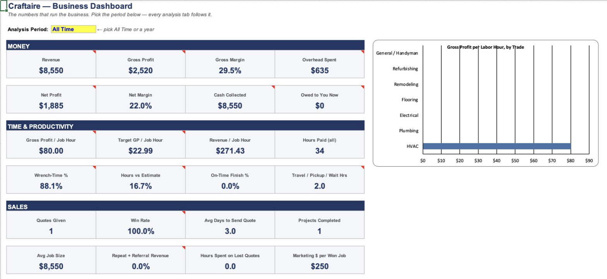

# TrueOps

**An AI-powered CRM and operations platform for a home services business, run entirely from a phone.**

TrueOps replaces the scattered texts, paper notes and memory that most trades businesses run on. The crew texts what happened on the job ("Me and Sam 8 to 4:30 on J-0001, install, 30 min lunch", or a photo of a receipt), and an LLM agent turns it into structured records in a relational CRM. Those records feed a custom business intelligence dashboard.

Built for Craftaire, a Chicago home services company (HVAC, flooring, electrical, remodeling, carpentry).


*The business dashboard, shown with fictional sample data.*

---

## What it does

- **Text-to-database AI agent.** Send a WhatsApp message or photo. A Claude-powered agent reads it, decides which tables to update, writes the rows, and replies with a confirmation, including a one-word `UNDO`.
- **Relational CRM.** 12 linked tables: Clients, Properties, Quotes, Projects, Change Orders, Time Log, Expenses, Invoices, Team, Vendors, Callbacks and Market Rates. It tracks lead source, referrals, quote win rate, lifetime revenue and gross profit per client, and flags past customers for re-engagement.
- **Business intelligence dashboard.** Headline KPIs, a performance scoreboard by trade, a "Needs Attention" alert panel, and a selectable analysis period. It's powered by seven analytics modules: Trade Analysis, Project Types, Time Analysis, Pricing & Hiring, Marketing, Clients & Areas, and Monthly Trend.
- **Ask questions in plain English.** "How much do we have outstanding?" or "What's our win rate on HVAC quotes?" are answered from live data.

## Architecture

```
 WhatsApp message / photo
          │
          ▼
 WhatsApp Cloud API (Meta)
          │  webhook
          ▼
 Cloudflare Worker  ── relay/worker.js
   verifies Meta's signature, forwards with a shared secret
          │
          ▼
 Google Apps Script  ── agent/Code.gs
   • access control: only phone numbers on the Team table
   • reads the live schema + recent data → builds the prompt
          │
          ▼
 Claude API
   returns structured actions (add / update rows)
          │
          ▼
 Apps Script applies the actions → CRM data layer
   audit log + one-step UNDO → WhatsApp confirmation reply
```

The CRM itself (tables, formulas, validation, conditional formatting, dashboard and charts) is **generated from code** by `crm/build_workbook.py`, so the whole data layer can be rebuilt or changed reproducibly.

## Key engineering details

- **Schema-aware prompting.** The agent reads column headers and dropdown lists at runtime, so changes to the CRM don't require prompt rewrites.
- **Context building.** Open projects, open invoices, team members and recent conversation are packed into each request so the model can resolve references like "the Johnson job".
- **Multimodal input.** Photos and documents (such as receipts and invoices) are passed to Claude as images.
- **Safety.** The webhook signature is checked at the edge, a shared relay key is required, writes are restricted to an allow-list of phone numbers, every write is logged, and the last change can be reversed with `UNDO`.
- **Workflow automation.** Payments are matched to open invoices, IDs are generated automatically (`C-0001`, `J-0001`, `INV-0001`…), cross-table lookups are relational, and data-quality checks flag bad entries.

## Repository layout

```
agent/Code.gs            Google Apps Script: webhook handler, prompt building, Claude call, writes, undo
relay/worker.js          Cloudflare Worker: secure relay from Meta to Apps Script
crm/build_workbook.py    Python (openpyxl) generator for the 22-tab CRM + dashboard
docs/SETUP.md            Step-by-step deployment guide
```

## Tech stack

Claude API · Python (openpyxl) · JavaScript · Google Apps Script · Cloudflare Workers · WhatsApp Cloud API

## Getting started

```bash
pip install openpyxl
python crm/build_workbook.py --gsheets   # builds the CRM workbook
```

Then follow [docs/SETUP.md](docs/SETUP.md) to connect WhatsApp, the Cloudflare relay and the Claude API.

> All sample data in the workbook is fictional and marked `EXAMPLE`.

## Roadmap

- AI receptionist: answer and qualify inbound calls, then log leads to the CRM
- Automated lead follow-up and review-request workflows
- Voice-note support

---

Built by [Faizan Ali](https://www.linkedin.com/in/faizanali11/).
